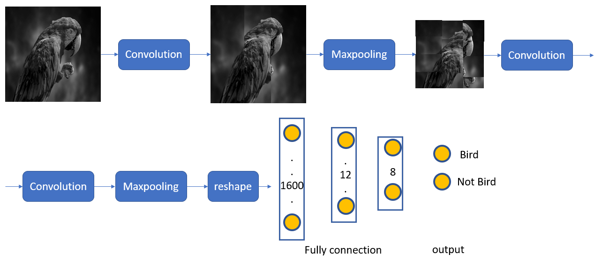
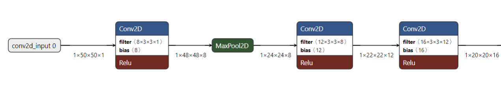
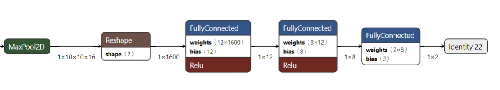
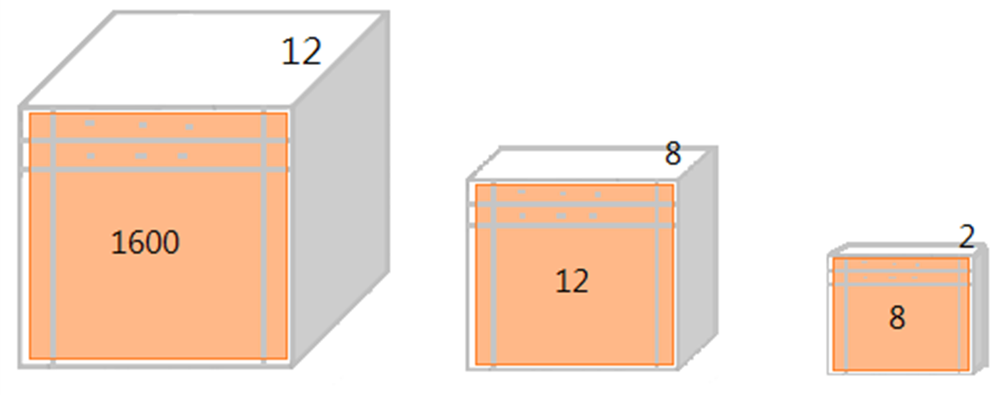

# FPGA CNN Accelerator for Gender Classification

## Project Overview
This project proposes a Convolutional Neural Network (CNN) hardware accelerator designed to classify gender from a grayscale facial image. The entire CNN is deployed on an FPGA and processes **50×50 8-bit grayscale input images**. The accelerator is optimized for low hardware utilization and efficient data reuse while achieving accurate classification with minimal clock cycles.

---

## Problem Statement
Deploying CNNs on resource-constrained hardware like FPGAs introduces challenges:
- Limited on-chip memory and register availability.
- Power and area constraints.
- Need for efficient layer fusion and reuse to minimize clock cycles.

Our goal is to **optimize CNN computation for real-time inference** on FPGA by carefully designing each component (convolution, max pooling, fully connected layers) to reuse hardware and minimize latency.

---

##  CNN Architecture

The full network can be divided into **two main stages**, as shown in the diagrams:

### 🔹 Stage 1: Convolutional Layers

| Layer        | Parameters                | Output Shape      |
|--------------|---------------------------|-------------------|
| Input        | 50×50×1                   | 1×50×50×1         |
| Conv2D_1     | 8 filters, 3×3×1 + ReLU    | 1×48×48×8         |
| MaxPool2D    | 2×2                        | 1×24×24×8         |
| Conv2D_2     | 12 filters, 3×3×8 + ReLU   | 1×22×22×12        |
| Conv2D_3     | 16 filters, 3×3×12 + ReLU  | 1×20×20×16        |
| MaxPool2D    | 2×2                        | 1×10×10×16        |

---

### 🔹 Stage 2: Flatten + Fully Connected Layers

| Layer            | Parameters                     | Output Shape  |
|------------------|--------------------------------|----------------|
| Reshape          | Flatten to 1×1600              | 1×1600         |
| FC_1 + ReLU      | Weights: 12×1600, Bias: 12     | 1×12           |
| FC_2 + ReLU      | Weights: 8×12, Bias: 8         | 1×8            |
| FC_3             | Weights: 2×8, Bias: 2          | 1×2            |
| Identity Layer   | Classification Output          | 1×2            |

---

##  Hardware Optimization Techniques

### 📌 Max Pooling Implementation
We used a **queue-based(FIFO) structure** to implement max pooling efficiently:
- As soon as the queue accumulates `(w+2)` values, we compute the max result from head and tail without scanning the entire kernel.  
- This approach saves register space and accelerates pooling with **minimal logic**.

  

### 📌 Fully Connected Layer Optimization
Our fully connected layer is designed like a convolution operation:
- Treating flatten input as a "1D feature map", we apply weight matrices using **sliding window style**.
- All 3 FC layers are implemented **in one unified module**, significantly reducing hardware redundancy.
- This module uses **register reuse** and **MUX switching** to handle multiple layers and minimize area.

###  Flatten Operation Fusion
Flatten is **implicitly integrated**:
- After the second max pooling, data is directly written to memory in a flattened format.
- This avoids a separate flatten stage, reducing overhead.

---

##  Hardware Summary

- **Total Clock Cycles**: 214,592 cycles  
- **Max Frequency**: 41.68 MHz  
- **Design Tradeoff**: Hardware reuse leads to more MUX logic → increased critical path → limited frequency  
- **Register Reuse**: Improves power and area efficiency

---

## ✅ Conclusion

Through efficient **hardware-software co-design**, we successfully implemented a CNN inference accelerator on FPGA that balances:
- Low hardware resource usage
- High computational efficiency
- Maintainable classification accuracy

This approach demonstrates how CNNs can be optimized for **real-time, edge-level inference** in resource-constrained environments.

